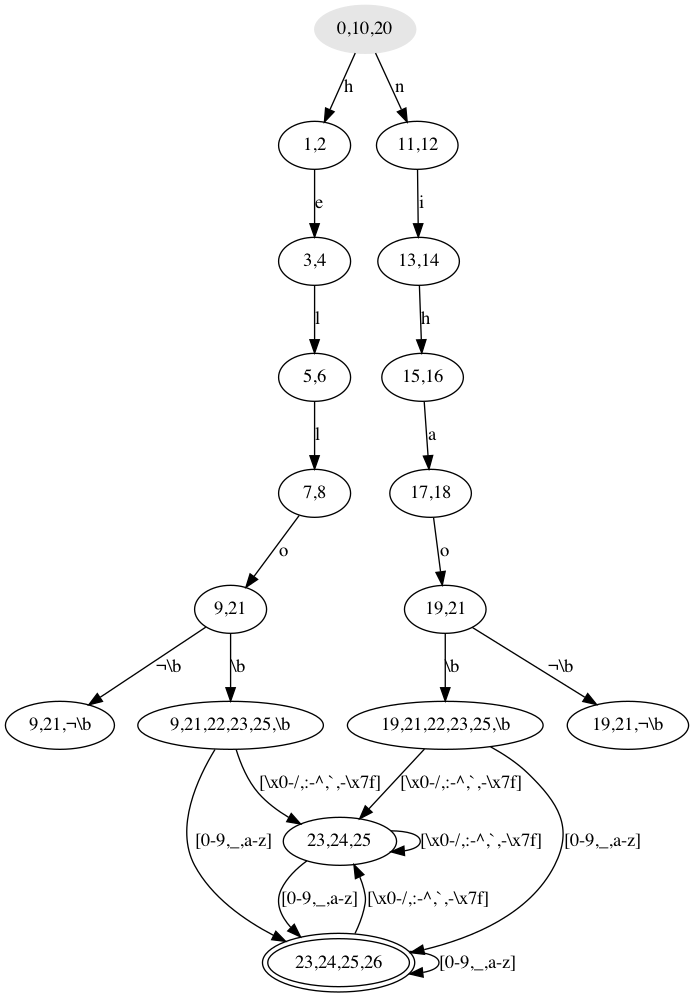

# RegexMatcher

Regular expression parser and matcher, among a few other things, WIP.

### Requirement:

- [Rust](https://www.rust-lang.org/tools/install) 
- `graphviz` if you would like to use `dot` to visualize the generated NFA/DFA

### Try it out:

This is a work-in-progress project that implements a Regex engine from scratch in Rust.
It parses an input regular expression, generates an NFA from it, then converts the NFA
to a DFA. Then, a string can be tested to see if it belongs to the language defined by 
this DFA. Tweak `src/main.rc` to however you would like to interact with it.

You can visualize the generated NFA and DFA for an input regex by first using
`write_graph_to_file` to generate the [dot file](https://en.wikipedia.org/wiki/DOT_(graph_description_language)),
which can then be compiled to obtain the image, like so: 
```bash
dot -Tpng out/nfa.dot > out/nfa.png
```

### Capabilities:

Most of the capabilities, including boundaries (`\b`, `$`, `^`). For example, regex `(hello|nihao)\b+.*[\da-z_]+` can 
match strings such as: `hello a`, `nihao   \\\_`, `nihao,j`. The corresponding DFA and NFA are:



### TODOs:

- allow match groups 
- allow find all substring matches
- allow specifying number of consecutive matches like `(abc){2}`
- optimizations and more extensive testing
